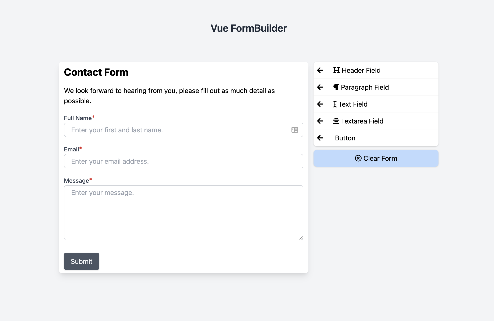
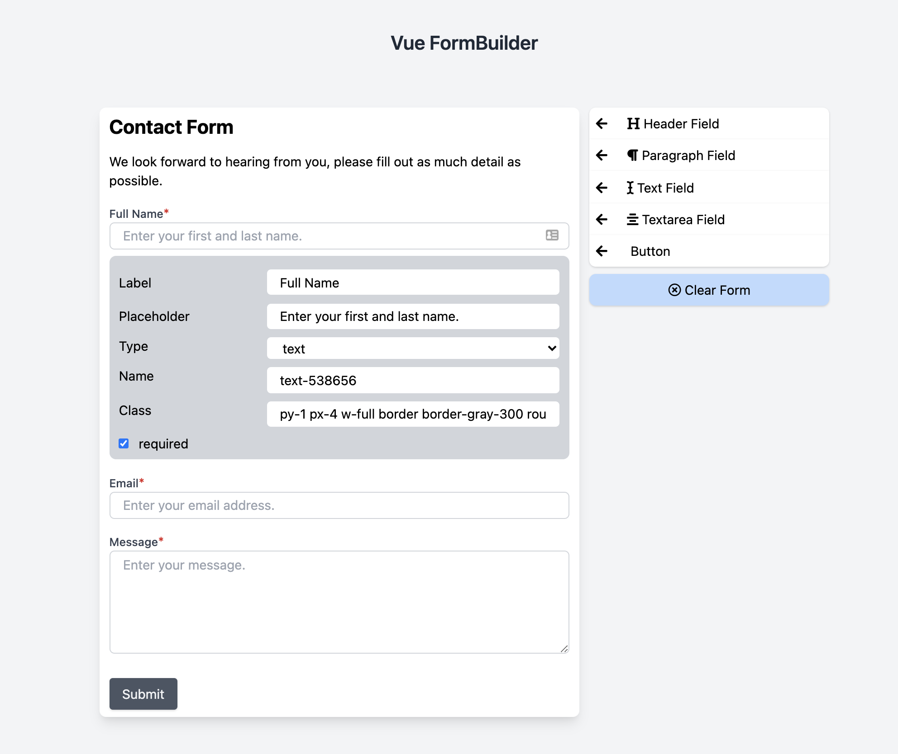

# Vue.js formbuilder using TailwindCss

This project was inspired out of the need for a drag and drop form builder. There is a jQuery formBuilder but I couldn't find one that was built with Vue so I decided to take on the project.

This project isn't ready for production yet, still has a lot of work. But if you'd like to contribute, please do!

# To get started
- First, install the package with the following command `npm install @jringeisen/vue-formbuilder`
- Then import the package `import FormBuilder from '@jringeisen/vue-formbuilder'`
- Then make sure to add `Vue.use(FormBuilder)` so that you can use the component globally.

If you don't have tailwind installed you can import the package styling by using `import '@jringeisen/vue-formbuilder/dist/jringeisen.css'` or you can import tailwindcss.

# To render a form
- Make sure to `import FormRender from '@jringeisen/vue-formrender'` then add `Vue.use(FormRender)` so that you can use the component globally.
- The FormRender component takes a formJson prop which is the JSON produced from the FormBuilder component.

# ToDo
- [X] Convert to a package
- [ ] Add more field options
- [ ] Make fields draggable

