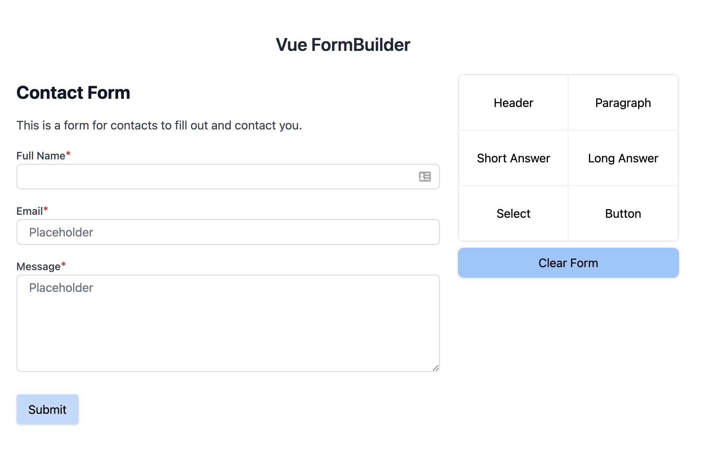
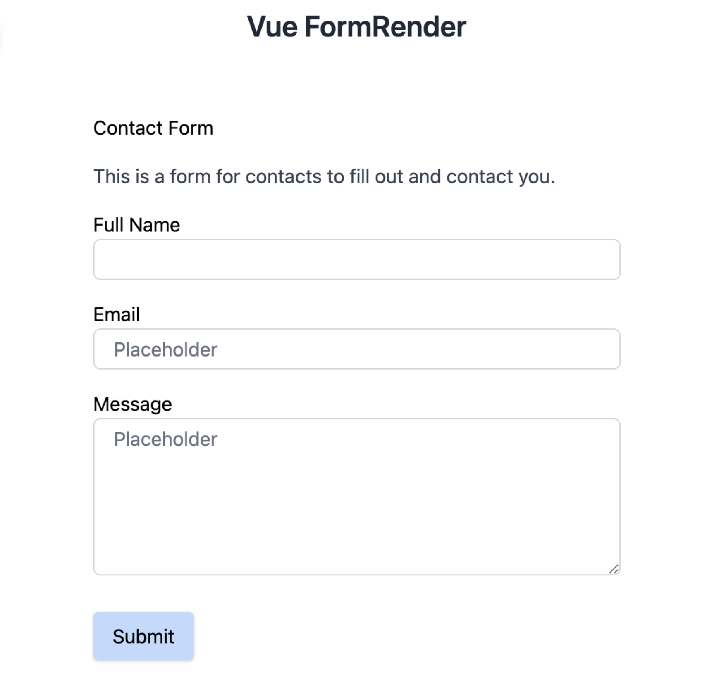

# Vue.js formbuilder using TailwindCss

This project was inspired out of the need for a drag and drop form builder. There is a jQuery formBuilder but I couldn't find one that was built with Vue so I decided to take on the project.

This project isn't ready for production yet, still has a lot of work. But if you'd like to contribute, please do!

# Installation
- Run `npm install @jringeisen/vue-formbuilder`

# Getting started with the FormBuilder Component
- Import the formbuilder component in your entry vue file using `import FormBuilder from '@jringeisen/vue-formbuilder'`.
- Then make sure to add `Vue.use(FormBuilder)`.

Now you will have access to the `<form-builder />` component, add it to the page you would like to use the form builder on. 
Each time you add a field a `form` event is triggered. You can do the following `<form-builder @form="yourMethodHere" />` to
capture the json string which you can save in a database so you can pass it to the render component.

# Getting started with the FormRender Component
- Import the formrender component in your entry vue file using `import FormRender from '@jringeisen/vue-formbuilder'`.
- Then make sure to add `Vue.use(FormRender)`.

Now you will have access to the `<form-render />` component, add it to the page you would like to render your form on.
The form render component accepts a `formJson` prop like this `<form-render form-json="formBuilderJsonStringHere">`.

If you don't have tailwind installed you can import the package styling by using `import '@jringeisen/vue-formbuilder/dist/jringeisen.css'` or you can import tailwindcss.

# ToDo
- [X] Convert to a package
- [X] Add a form render component
- [ ] Add more field options
- [ ] Make fields draggable

